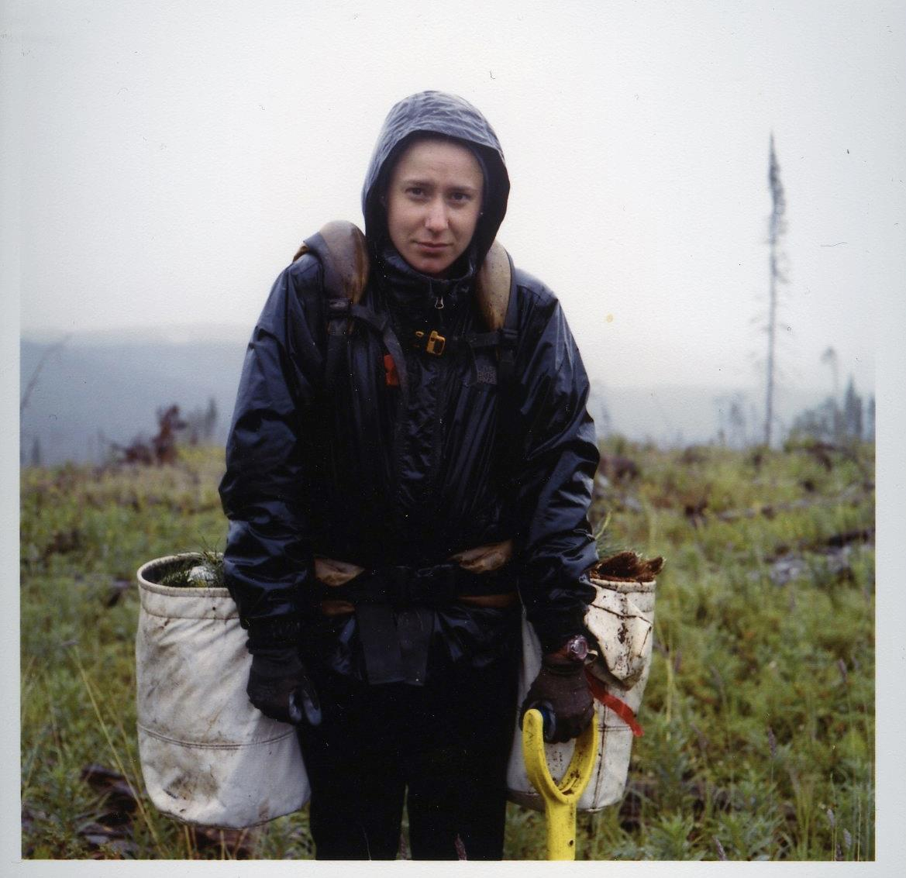

#  Tree Planting: Ecological Restoration with Human Dimensions
> Undergraduate Anthropology Honours Thesis - Submitted December 2012

## Abstract

In Canada, approximately 687, 672 hectares of forest are harvested each year. Due to strict provincial regulations, the majority of the harvested areas will be replanted by hand, one sapling at a time. The extremely physical and demanding job attracts university students and transient young people who enjoy the high earnings and unique lifestyle that comes with living and working in rural bush camps. At the centre of the job and lifestyle is the human body; the critical tool for tree planting. This paper is an analysis of how three important features of tree planting, nature, capitalism and Canadian nationalism directly influence and change the bodies of tree planters.

## Meta

Alice Walker – [@atatwalker](https://twitter.com/aliceemmwalker)

 This work is licensed under a <a rel="license" href="http://creativecommons.org/licenses/by-nc-nd/4.0/">Creative Commons Attribution-NonCommercial-NoDerivatives 4.0 International License</a>.

[https://github.com/atatwalker/Ecological-Restoration-With-Human-Dimensions](https://github.com/atatwalker)

[npm-image]: https://img.shields.io/npm/v/datadog-metrics.svg?style=flat-square
[npm-url]: https://npmjs.org/package/datadog-metrics
[npm-downloads]: https://img.shields.io/npm/dm/datadog-metrics.svg?style=flat-square

